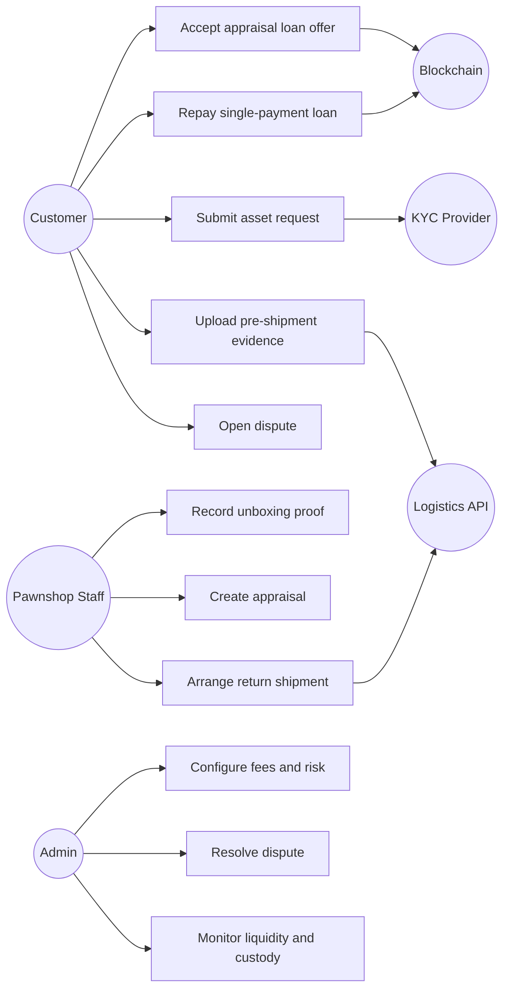
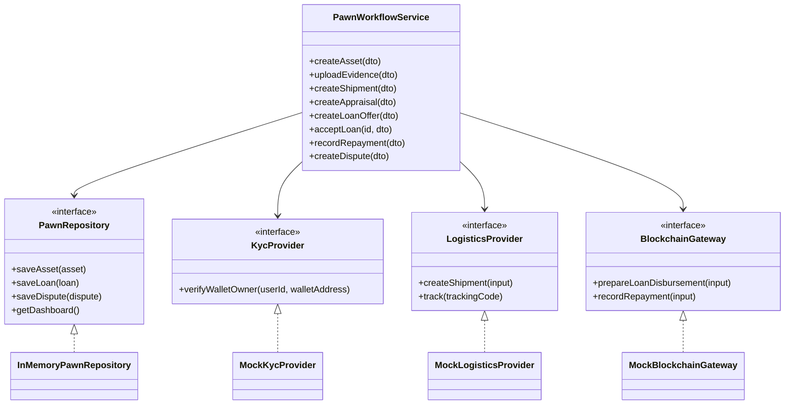
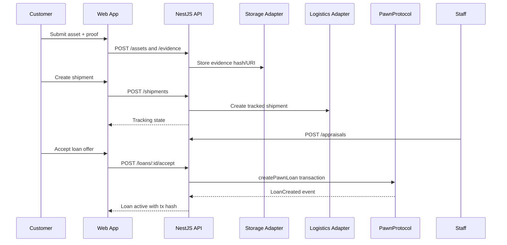
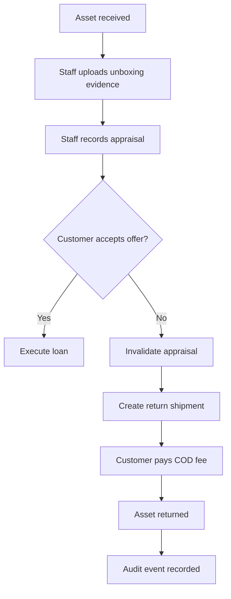
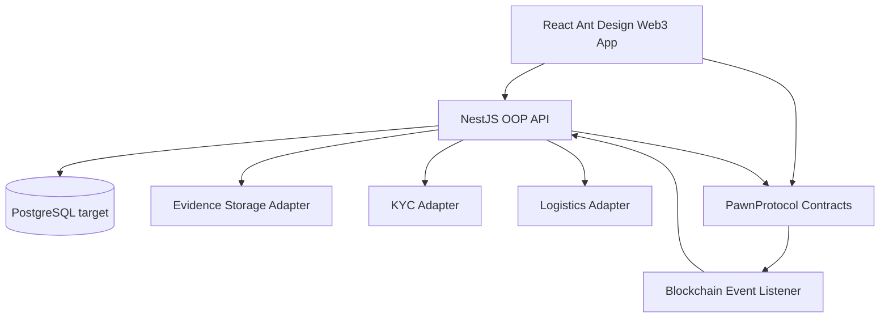
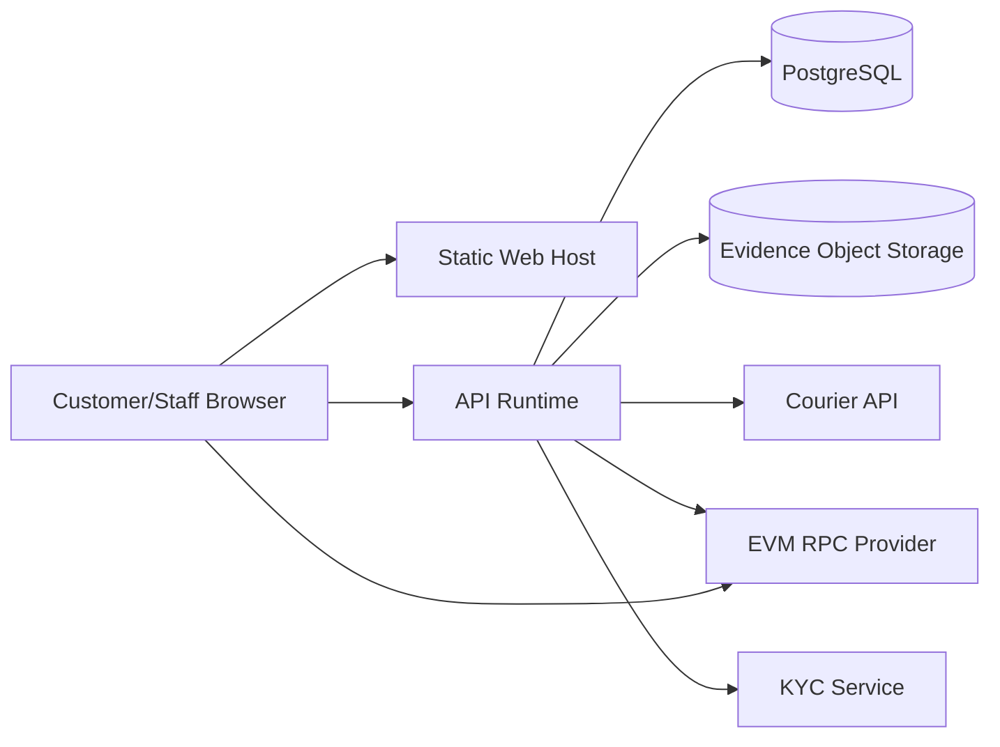

# Blockchain-Enabled Physical Asset Pawnshop Architecture

## Architectural Style

The capstone is organized as a layered, object-oriented web system with a bounded smart-contract settlement layer.

- `apps/web`: React + Ant Design + Ant Design Web3 user interface.
- `apps/api`: NestJS backend with controllers, DTOs, services, ports, repositories, domain models, and adapters.
- `PawnShop-SmartContract`: Solidity contracts for token custody, loans, marketplace, layaway, and fractionalization.
- `docs/architecture`: design rationale, UML-style diagrams, and SRS traceability.

The backend owns off-chain workflow state: users, KYC, shipments, evidence files, appraisal records, disputes, audit events, and blockchain event indexing. Smart contracts own irreversible token custody and crypto settlement.

## Running Demo System

### Auth / Session

A demo auth endpoint `POST /api/auth/demo-login` accepts a role (`CUSTOMER`, `STAFF`, or `ADMIN`) and returns a typed session object with a signed mock JWT. The frontend auto-logs in as `CUSTOMER` on page load via this endpoint and stores the session in React state. The role selector in the topbar switches sessions without a page reload.

Three seeded users are available:

| Role | userId | Display Name | Wallet |
|---|---|---|---|
| CUSTOMER | `customer-1` | Demo Customer | `0x1111111111111111111111111111111111111111` |
| STAFF | `staff-1` | Demo Staff | `0x2222222222222222222222222222222222222222` |
| ADMIN | `admin-1` | Demo Admin | `0x3333333333333333333333333333333333333333` |

### UI Route Groups / Tabs

The React app (`apps/web`) is organized into four tabs:

1. **Customer Portal** — asset submission, evidence upload, shipment creation, loan acceptance, repayment, and listing returned assets for sale.
2. **Staff / Validator Dashboard** — validation queue, unboxing proof upload, appraisal and loan-offer creation.
3. **Admin Panel** — live dashboard metrics (active loans, vault assets, open disputes, protocol fees) and audit event log.
4. **Marketplace** — active listings viewer with layaway purchase action.

Each tab enforces role-aware rendering: if the active session role does not match the tab's expected role, a **Role Mismatch** alert is displayed and action buttons are disabled.

### E2E Test Structure

Playwright tests live under `apps/web/e2e/` and are split into two files:

- **`workflow.spec.ts`** — stateful tests that mutate backend state (loan submission, listing creation, role switching). Runs on `desktop-workflow` project only (`workers: 1`) to avoid corrupting the shared in-memory repository across parallel Playwright projects.
- **`responsive.spec.ts`** — read-only layout tests that run across desktop (1440 × 900), tablet (768 × 1024), and mobile (390 × 844) viewports.

## Use Case Diagram

## Class Diagram

## Sequence Diagram: Accepted Appraisal Loan

## Activity Diagram: Declined Appraisal Return

## Component Diagram

## Deployment Diagram

## OOP Notes For Presentation

- Encapsulation: domain state is manipulated through `PawnWorkflowService`, not directly by controllers.
- Abstraction: external dependencies are represented by interfaces such as `KycProvider`, `LogisticsProvider`, and `BlockchainGateway`.
- Polymorphism: mock adapters can be replaced by production adapters without changing application services.
- Separation of concerns: controllers handle HTTP, DTOs validate input, services enforce workflows, repositories persist data, and contracts settle irreversible financial actions.
